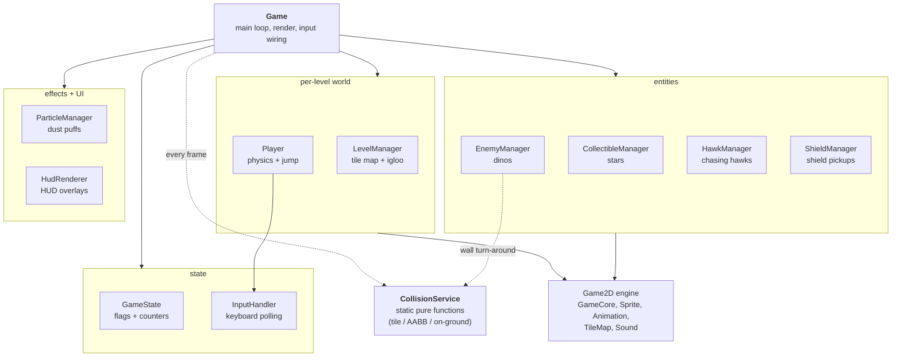

# Penguin Adventure

> A 2D platformer in Java — guide a penguin across icy levels, dodge enemies, collect stars, and reach the igloo.

[](https://github.com/joeln45/penguin-adventure/actions/workflows/build.yml)


https://github.com/user-attachments/assets/4a86e10f-6561-4cc2-b6f8-9db6b5eb91d7

## Screenshots

| Main menu | Level 1 | Level 2 |
|---|---|---|
|  |  |  |

## Controls

| Key | Action |
|---|---|
| `←` / `→` | Move left / right |
| `↑` | Jump (tap for short hop, hold for full height) |
| Tap `↑` mid-air | Free double-jump (one per airborne span) |
| `B` | Toggle debug overlay (hitboxes, FPS, screen bounds) |
| `Esc` | Quit |

## Play

Grab the pre-built JAR from the [Releases page](https://github.com/joeln45/penguin-adventure/releases) and run it with any JDK 17+:

```bash
java -jar penguin-adventure-1.0.0.jar
```

## Build from source

Requirements: **JDK 17+** and **Maven 3.9+**.

```bash
git clone https://github.com/joeln45/penguin-adventure.git
cd penguin-adventure
mvn compile exec:java
```

Or open the folder in VS Code (with the Java Extension Pack) and click **Run** on `Game.java` once Maven import finishes.

To run the tests:

```bash
mvn test
```

To build the runnable JAR yourself:

```bash
mvn clean package
# produces target/penguin-adventure-1.0.0.jar
```

## Features

### Gameplay
- Three hand-designed levels with a level-select menu and a level-complete transition.
- Parallax-scrolling desert backgrounds (four layers).
- Patrolling dino enemy that turns at walls; chasing hawk that tracks the player when in sight.
- Collectible spinning stars (3 per level) and a shield pickup that absorbs one hit.
- 3 lives per level — flicker invincibility for 2 s after taking damage.

### Game feel
- **Coyote time** — 100 ms grace to jump after walking off a ledge.
- **Jump buffering** — pressing jump up to 150 ms before landing still fires.
- **Variable jump height** — tap for a short hop, hold for a full jump.
- **Free mid-air jump** — one per airborne span, resets on touching ground.
- **Landing-dust particles** — small puff at the player's feet on touchdown.
- **Pause on window blur** — alt-tab freezes gameplay and dims the screen.

### Audio
- WAV + MIDI audio with custom sound filters (echo, fade-in, volume boost).
- Mute toggle silences both WAV sound-effects **and** MIDI background music.

### Engineering
- Tile-based level loading from plain-text map files in `src/main/resources/maps/`.
- AABB collision detection with two-pass swept resolution (X then Y), frame-projected positions, and integer-pixel snapping.
- GitHub Actions CI runs `mvn -B -ntp verify` on Ubuntu / Temurin 17.
- JUnit 5 test suite (22 tests) covering collision math, velocity clamping, and the sound filters.

## Architecture

The original `Game.java` from coursework was a 1,276-line god class. The current code splits responsibilities into focused components — `Game` is the orchestrator that calls into per-concern managers, and `CollisionService` is a stateless helper:



### Design notes

- **One manager per concern.** Each entity type (`CollectibleManager`, `EnemyManager`, `HawkManager`, `ShieldManager`, `ParticleManager`) owns its sprites, per-level spawn table, update loop, and draw call. Adding a new pickup type is a copy-paste of an existing manager.
- **`CollisionService` is stateless.** Pure functions in / pure functions out makes the math straightforward to unit-test (`CollisionServiceTest`) and removes a class of "stale flag" bugs.
- **`GameState` is a plain data bag.** No behaviour — just flags (`gameOver`, `isMuted`, `shields`, `lives`). `Game` drives all transitions explicitly so the menu / playing / game-over / completed flow is readable from one place.
- **`InputHandler` decouples from AWT.** Game polls `isMoveLeft()` / `isJump()` / `jumpPressedAt()` instead of listening for `KeyEvent`s directly. This is what makes coyote-time and jump-buffer easy to implement.
- **Physics in pixels-per-millisecond.** `Sprite.update(elapsed)` advances position by `velocity * elapsed`, so collision detection has to project a full frame ahead (`sx + vx * elapsed`) — not 1 ms ahead. Forgetting this was the cause of every wall-snag and air-walk bug during development.

## Project layout

```
src/
├── main/
│   ├── java/com/joeln45/penguin/
│   │   ├── Game.java                    orchestrator + main loop
│   │   ├── GameState.java               flags + counters
│   │   ├── Player.java                  physics, jump, gravity
│   │   ├── InputHandler.java            keyboard polling
│   │   ├── LevelManager.java            tile map + igloo placement
│   │   ├── CollisionService.java        static collision math
│   │   ├── CollectibleManager.java      stars
│   │   ├── EnemyManager.java            patrolling dinos
│   │   ├── HawkManager.java             chasing hawks
│   │   ├── ShieldManager.java           shield powerup
│   │   ├── ParticleManager.java         landing dust
│   │   ├── HudRenderer.java             HUD overlays
│   │   ├── AssetLoader.java             cached sounds + images
│   │   ├── ParallaxBackground.java      4-layer parallax
│   │   └── engine/                      Game2D base library
│   └── resources/
│       ├── images/                      sprite sheets, tiles, backgrounds
│       ├── sounds/                      WAV + MIDI
│       └── maps/                        plain-text tile maps
└── test/java/com/joeln45/penguin/       JUnit 5 suite (22 tests)
```

## Tech stack

- **Java 17**, Swing / AWT
- Custom **Game2D** engine (sprites, animation, tilemaps, sound) — the base library was provided in the CSCU9N6 module by David Cairns; the four sound filters and all gameplay code are mine
- **Maven** for build & dependency management
- **JUnit 5** for testing, **GitHub Actions** for CI
- Assets: hand-edited PNG sprite sheets + WAV / MIDI audio

## What I learned

This started as a Year-3 university coursework project. Modernising it for portfolio taught me:

- **Game-feel is mostly invisible.** Coyote time, jump buffering, variable jump height — none are visible to a player, but together they're the difference between a game that feels mushy and one that feels tight. The implementation is ~30 lines.
- **Frame-projected collision matters.** Tile collision check has to ask *"where will I be next frame?"* not *"where am I now?"*. Getting this subtle bug right killed every wall-snag and air-walk symptom I'd been chasing for hours.
- **Refactoring a god class is mostly extraction, not redesign.** Cutting `Game.java` from 1,276 → ~520 lines was twelve small extractions, each preserving behaviour. The architecture diagram above didn't exist when I started — it fell out of repeatedly asking "what is this method really about?".
- **Resource loading the right way.** Moving from `new FileInputStream(...)` to classpath resources (`getResourceAsStream`) so the build runs from a JAR, not just an IDE.
- **Build tooling migration.** Converting an Eclipse project to Maven, untangling source/resource layout, and making the project IDE-agnostic.
- **CI catches what local doesn't.** Linux is case-sensitive; Windows isn't. Forgetting to commit `CollisionService.java` after a multi-file refactor compiled fine locally and failed instantly on CI.

## Roadmap

- [x] Maven build + classpath resources
- [x] README v1 + screenshots
- [x] GitHub Actions CI on Ubuntu / Temurin 17
- [x] Refactor `Game.java` into `Player`, `EnemyManager`, `CollisionService`, etc.
- [x] JUnit 5 tests for collision, velocity & sound filters
- [x] Chasing hawk enemy
- [x] Third level with level-select menu
- [x] 3 lives per level
- [x] Pause on window blur with overlay
- [x] Mute toggle silences MIDI background music
- [x] Two-pass swept collision with frame-projected positions
- [x] Coyote time, jump buffering, variable jump height
- [x] Free mid-air jump (one per airborne span)
- [x] Landing-dust particle system
- [x] Shield powerup that absorbs one hit
- [x] Tagged v1.0.0 release with downloadable JAR

## Credits

- **Code & gameplay design:** Joel Nirmal
- **Game2D engine base:** David Cairns (CSCU9N6, University of Stirling)
- **Background art:** sourced from the CSCU9N6 asset pack

## License

[MIT](LICENSE) © 2026 Joel Nirmal
