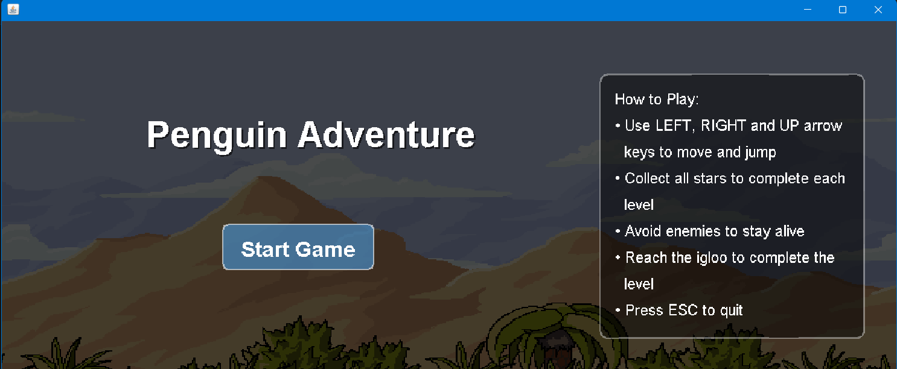
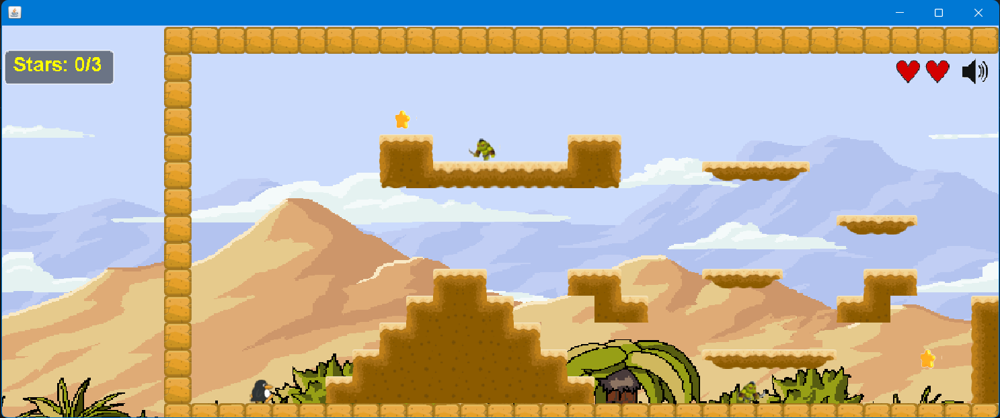
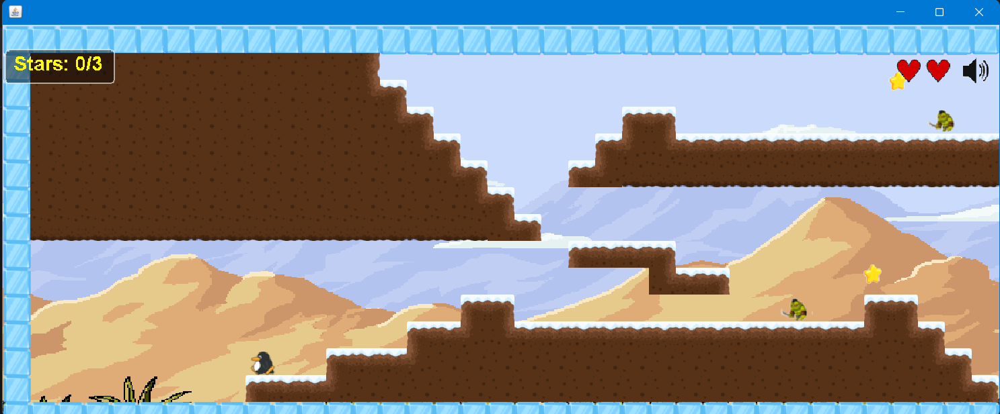

# Penguin Adventure

> A 2D platformer in Java — guide a penguin across icy levels, dodge enemies, collect stars, and reach the igloo.

[](https://github.com/joeln45/penguin-adventure/actions/workflows/build.yml)


https://github.com/user-attachments/assets/4a86e10f-6561-4cc2-b6f8-9db6b5eb91d7

## Screenshots

| Main menu | Level 1 | Level 2 |
|---|---|---|
|  |  |  |

## Controls

| Key | Action |
|---|---|
| `←` / `→` | Move left / right |
| `↑` | Jump |
| `B` | Toggle debug overlay (hitboxes, FPS) |
| `Esc` | Quit |

## Build & run

Requirements: **JDK 17+** and **Maven 3.9+**.

```bash
git clone https://github.com/joeln45/penguin-adventure.git
cd penguin-adventure
mvn compile exec:java
```

Or open the folder in VS Code (with the Java Extension Pack) and click **Run** on `Game.java` once Maven import finishes.

## Features

- Parallax-scrolling desert background
- Tile-based level loading from plain-text map files
- Animated sprite sheets (idle / run / jump)
- AABB collision detection against tile geometry
- Patrolling dino enemy with player damage + 2-second invincibility flicker
- Collectible spinning stars + lives HUD
- Two hand-designed levels with a level-complete transition
- WAV + MIDI audio with custom sound filters (echo, fade-in, volume boost)
- Mute toggle, menu / pause / game-over screens

## Tech stack

- **Java 17**, Swing / AWT
- Custom **Game2D** engine (sprites, animation, tilemaps, sound) — the base library was provided in the CSCU9N6 module by David Cairns; the four sound filters and all gameplay code are mine
- **Maven** for build & dependency management
- Assets: hand-edited PNG sprite sheets + WAV/MIDI audio

## What I learned

This started as a Year-3 university coursework project. Modernising it taught me:

- **Game loop architecture** — separating update from render, frame-rate-independent physics with `dt`
- **Resource loading the right way** — moving from `new FileInputStream(...)` to classpath resources (`getResourceAsStream`) so the build runs from a JAR, not just an IDE
- **Refactoring a monolith** — the original `Game.java` was 1,250+ lines; breaking it into cohesive components is in progress (see roadmap)
- **Build tooling migration** — converting an Eclipse project to Maven, untangling source/resource layout, and making the project IDE-agnostic

## Roadmap

- [x] Maven build + classpath resources
- [x] README v1 + screenshots
- [x] GitHub Actions CI
- [x] Refactor `Game.java` into `Player`, `EnemyManager`, `CollisionService`, etc.
- [x] JUnit 5 tests for collision & sound filters
- [x] Double-jump powerup
- [x] Chasing hawk enemy
- [ ] Third level
- [ ] Mute MIDI on toggle (currently only WAV silences)
- [ ] Tagged v1.0.0 release with downloadable JAR

## Credits

- **Code & gameplay design:** Joel Nirmal
- **Game2D engine base:** David Cairns (CSCU9N6, University of Stirling)
- **Background art:** sourced from the CSCU9N6 asset pack

## License

[MIT](LICENSE) © 2026 Joel Nirmal
