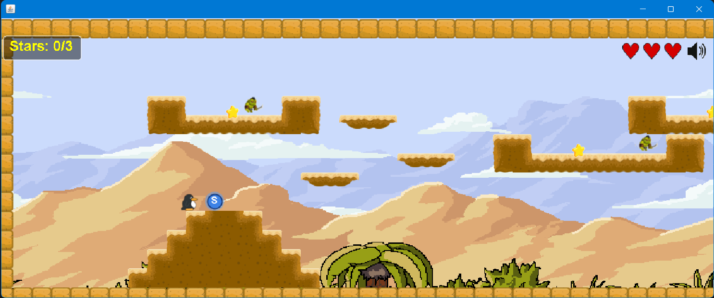
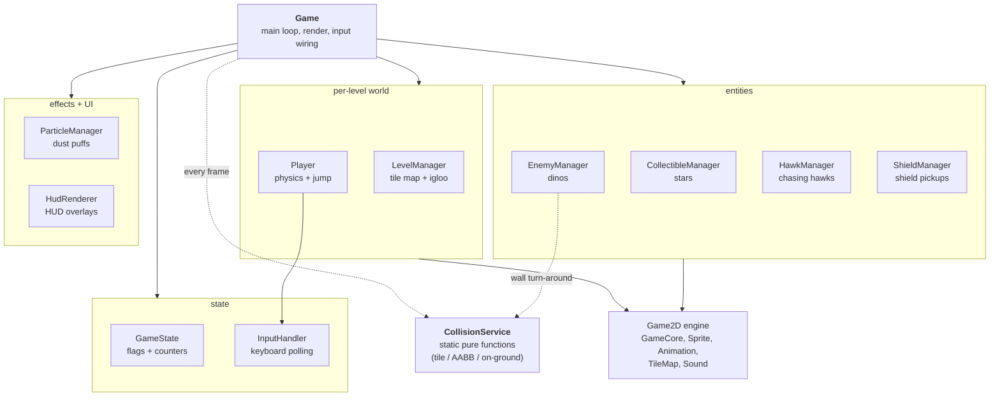

# Penguin Adventure

> A 2D platformer in Java — guide a penguin across icy levels, dodge enemies, collect stars, and reach the igloo.

[](https://github.com/joeln45/penguin-adventure/actions/workflows/build.yml)


https://github.com/user-attachments/assets/4a86e10f-6561-4cc2-b6f8-9db6b5eb91d7

## Screenshots

| Main menu | Level 1 | Level 2 | Level 3 |
|---|---|---|---|
|  |  |  |  |

## Controls

| Key | Action |
|---|---|
| `←` / `→` | Move left / right |
| `↑` | Jump (tap for short hop, hold for full height) |
| Tap `↑` mid-air | Mid-air jump (one per airborne span) |
| `B` | Toggle debug overlay (hitboxes, FPS, screen bounds) |
| `Esc` | Quit |

## Play

Grab the pre-built JAR from the [Releases page](https://github.com/joeln45/penguin-adventure/releases) and run it with any JDK 17+:

```bash
java -jar penguin-adventure-1.0.0.jar
```

## Build from source

Requirements: **JDK 17+** and **Maven 3.9+**.

```bash
git clone https://github.com/joeln45/penguin-adventure.git
cd penguin-adventure
mvn compile exec:java
```

Or open the folder in VS Code (with the Java Extension Pack) and click **Run** on `Game.java` once Maven import finishes.

To run the tests:

```bash
mvn test
```

To build the runnable JAR yourself:

```bash
mvn clean package
# produces target/penguin-adventure-1.0.0.jar
```

## Features

### Gameplay
- Three hand-designed levels with a level-select menu.
- Four-layer parallax desert backgrounds.
- Patrolling dino enemy and a chasing hawk that tracks the player on sight.
- Collectible stars (3 per level), shield pickup that absorbs one hit, 3 lives per level.

### Game feel
- **Coyote time** (100 ms) to jump after walking off a ledge.
- **Jump buffering** (150 ms) so an early jump press still fires on landing.
- **Variable jump height** — tap for a short hop, hold for a full jump.
- One free mid-air jump per airborne span.
- Landing-dust particles, and pause-on-blur when the window loses focus.

### Audio
- WAV + MIDI with custom sound filters (echo, fade-in, volume boost).
- Mute toggle silences both WAV effects and MIDI music.

### Engineering
- Tile-based level loading from text map files in `src/main/resources/maps/`.
- Two-pass swept AABB collision (X then Y) with frame-projected positions.
- GitHub Actions CI on Ubuntu / Temurin 17.
- JUnit 5 suite covering collision math, velocity clamping, and the sound filters.

## Architecture

The original `Game.java` from coursework was a 1,276-line god class. I split it into focused components: `Game` orchestrates the main loop, per-concern managers own their entities, and `CollisionService` is a stateless helper for the math.



### Design notes

- **One manager per concern.** Each entity type owns its sprites, spawn table, update loop, and draw call, so adding a new pickup is essentially copying an existing manager.
- **`CollisionService` is stateless.** Pure functions make the math easy to unit-test in `CollisionServiceTest`.
- **`GameState` is a plain data bag.** Just flags and counters; `Game` drives all transitions explicitly.
- **`InputHandler` decouples from AWT.** Game polls `isJump()` and `jumpPressedAt()` instead of listening for `KeyEvent`s, which is what makes coyote-time and jump-buffer easy.
- **Physics is pixels-per-millisecond.** `Sprite.update(elapsed)` advances by `velocity * elapsed`, so collision has to project a full frame ahead (`sx + vx * elapsed`), not 1 ms.

## Project layout

```
src/
├── main/
│   ├── java/com/joeln45/penguin/
│   │   ├── Game.java                    orchestrator + main loop
│   │   ├── GameState.java               flags + counters
│   │   ├── Player.java                  physics, jump, gravity
│   │   ├── InputHandler.java            keyboard polling
│   │   ├── LevelManager.java            tile map + igloo placement
│   │   ├── CollisionService.java        static collision math
│   │   ├── CollectibleManager.java      stars
│   │   ├── EnemyManager.java            patrolling dinos
│   │   ├── HawkManager.java             chasing hawks
│   │   ├── ShieldManager.java           shield powerup
│   │   ├── ParticleManager.java         landing dust
│   │   ├── HudRenderer.java             HUD overlays
│   │   ├── AssetLoader.java             cached sounds + images
│   │   ├── ParallaxBackground.java      4-layer parallax
│   │   └── engine/                      Game2D base library
│   └── resources/
│       ├── images/                      sprite sheets, tiles, backgrounds
│       ├── sounds/                      WAV + MIDI
│       └── maps/                        plain-text tile maps
└── test/java/com/joeln45/penguin/       JUnit 5 suite (22 tests)
```

## Tech stack

- **Java 17**, Swing / AWT
- Custom **Game2D** engine (sprites, animation, tilemaps, sound). The base library is from CSCU9N6 (David Cairns); all gameplay code and the sound filters are mine.
- **Maven** for build, **JUnit 5** for tests, **GitHub Actions** for CI

## What I learned

This started as Year-3 coursework. Modernising it for portfolio taught me:

- **Game-feel is mostly invisible.** Coyote time, jump buffering and variable jump height are a few dozen lines each, but together they make movement feel tight instead of mushy.
- **Frame-projected collision.** The tile check has to ask *"where will I be next frame?"*, not *"where am I now?"*. Fixing this killed every wall-snag and air-walk bug I had.
- **Refactoring a god class is mostly extraction.** Cutting `Game.java` from 1,276 to ~520 lines was a series of small extractions, each preserving behaviour.
- **Classpath resources over `FileInputStream`.** That's what makes the build runnable from a JAR and not just an IDE.
- **CI catches what local doesn't.** Linux is case-sensitive, Windows isn't. Forgetting to commit a renamed file compiled fine locally and failed instantly on CI.

## Credits

- **Code & gameplay design:** Joel Nirmal
- **Game2D engine base:** David Cairns (CSCU9N6, University of Stirling)

## License

[MIT](LICENSE) © 2026 Joel Nirmal
